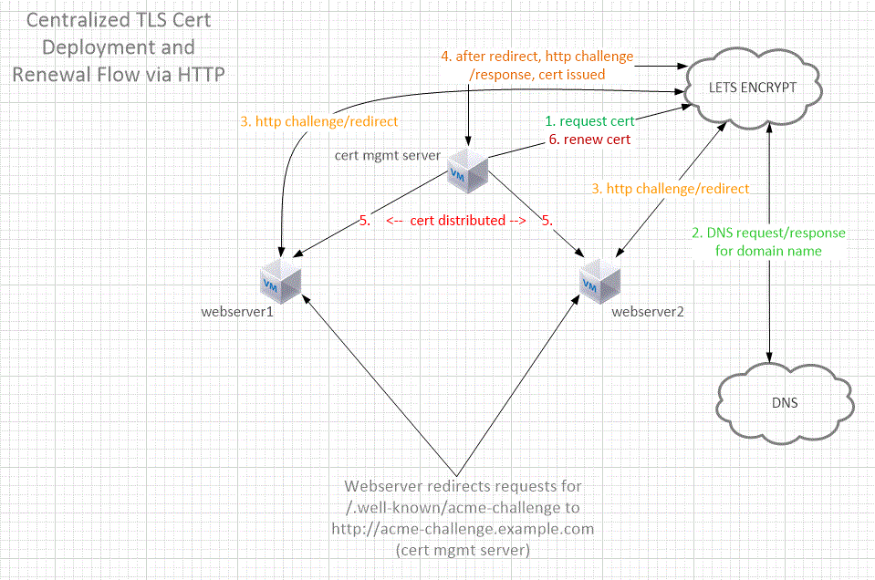
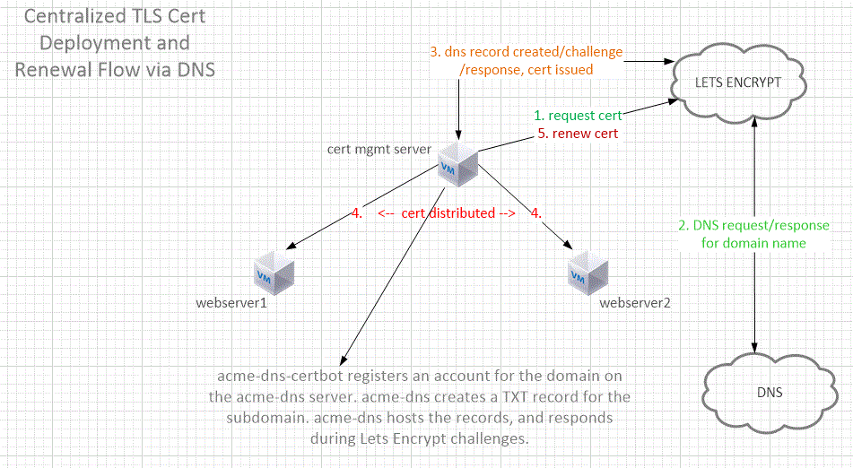

# Centralized Lets Encrypt Certificate Management

Deploy and renew Lets Encrypt TLS certificates from a central server.

Supports apache2 and nginx HTTP challenges. Supports DNS challenges using joohoi's [acme-dns](https://github.com/joohoi/acme-dns) and [acme-dns-certbot](https://github.com/joohoi/acme-dns-certbot-joohoi).

## Prerequsites

- a systemd-based Linux server, for managing certificates, with [Certbot](https://certbot.eff.org/instructions) and nginx installed
- relevant DNS records for the FQDNs you'll use
- ssh access to all servers
- if using HTTP challenges, ensure apache2 or nginx is installed on the servers hosting the certificates

### Our documentation is based on the following environment

- a modern version of Ubuntu on all servers
- acme-challenge.example.com as the domain for the certificate management server (CMS)
- portal.example.com as the domain name for our webserver using the certificate

## Network Diagrams

This is a basic view of the certificate management using HTTP challenges

### Brief Explanation of HTTP Flow

1. Using the deploy-cert script, the CMS will request a certificate for portal.example.com from Lets Encrypt
2. Lets Encrypt performs a DNS lookup for portal.example.com. Let's assume there are two DNS A records for portal.example.com in DNS - 10.1.1.1 and 10.2.2.2
3. Lets Encrypt will make an http request to one of the IP addresses from the DNS response
4. The webserver which receives the request will respond with a 301 redirect
    - Lets Encrypt honors the 301 redirect and sends the http request to the CMS
    - The CMS responds to the http challenge, Lets Encrypt validates the response and issues the certificate to the CMS
    - The certbot client stores the files locally on the CMS
5. The deploy-cert script finishes by copying the locally-stored certificate files to the webservers

This is a basic view of the certificate management using DNS challenges

### Brief Explanation of DNS Flow

1. Using the deploy-cert script, the CMS will request a certificate for portal.example.com from Lets Encrypt
2. Lets Encrypt performs a DNS lookup for portal.example.com. Let's assume there are two DNS A records for portal.example.com in DNS - 10.1.1.1 and 10.2.2.2
3. acme-dns-auth.py will register an account with the acme-dns server
    - the acme-dns server creates a txt record for the domain
    - you're prompted to create a CNAME record on your main DNS server(s) for _acme-challenge.portal.example.com that points to acme-challenge.example.com
    - Lets Encrypt initiates a DNS challenge, the acme-dns server responds, Lets Encrypt validates the response and issues the certificate to the CMS
    - The certbot client stores the files locally on the CMS
4. The deploy-cert script finishes by copying the locally-stored certificate files to the webservers

## Script file placement

if you're using HTTP challenges, deploy-site.sh should be copied to the webserver(s)

deploy-cert.sh and renew-cert.sh should be copied to the CMS

## Setup the Certificate Management System

Once you have the prerequsites taken care of, follow the steps found in [setup-cert-mgmt-system.md](setup-cert-mgmt-system.md)

## Start deploying certificates

Steps can be found in [deploy-certificates.md](deploy-certificates.md)

## Extras

The verify-http.sh script can be used to make sure that http is redirecting to https, https is responding, and the domain name matches the certificate.
This process is automatically done during site deployment. But if the verifications fail during this time, you can correct the errors and run verify-http.sh to only test the verifications.

The copy-cert.sh script can be used on the CMS if a certificate gets renewed, but the files aren't properly copied to the remote servers. Parameters are -d for the cert's domain name, and -h for the IPs of the remote hosts (use comma separated list for more than one host). It should be in the certbot user's home directory.
